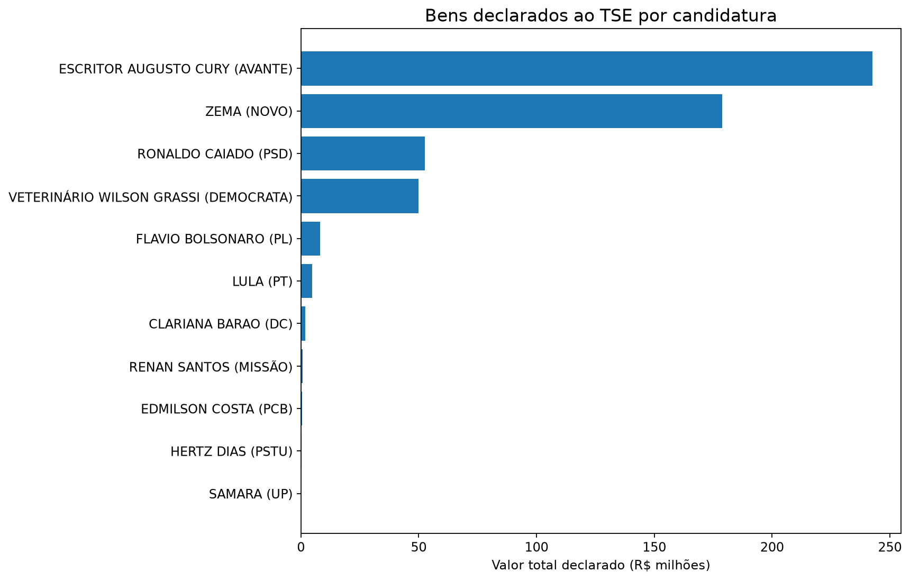

# Eleições 2026 — Data Analysis + GenAI

Neste projeto, analisei dados das candidaturas à Presidência da República nas Eleições 2026 utilizando dados públicos do Tribunal Superior Eleitoral (TSE).

Além dos dados estruturados, explorei os planos de governo utilizando **NLP, embeddings e RAG**, construindo um pipeline capaz de recuperar informações diretamente dos documentos oficiais.

O projeto tem caráter exclusivamente analítico e descritivo. As análises não representam avaliação ou recomendação de candidaturas, partidos ou propostas.

## O que eu quis explorar

Dividi o projeto em duas frentes.

Na primeira, trabalhei com os dados estruturados do TSE para analisar:

- perfil das candidaturas;
- idade e escolaridade;
- bens declarados à Justiça Eleitoral;
- qualidade e consistência dos dados.

Na segunda, trabalhei com os planos de governo para explorar:

- extração de texto de PDFs;
- TF-IDF e similaridade lexical;
- embeddings e busca semântica;
- RAG com modelos locais;
- avaliação de retrieval e grounding.

## Como construí

```text
TSE Open Data
     |
     +--------------------+
     |                    |
     v                    v
Candidaturas       Planos de governo
     |                    |
     v                    v
Processamento          pypdf
     |                    |
     v                    v
    EDA              Corpus textual
                          |
                 +--------+--------+
                 |                 |
                 v                 v
              TF-IDF            Chunking
                 |              500 / 75
                 v                 |
        Similaridade lexical       v
                         qwen3-embedding:0.6b
                                   |
                                   v
                           Busca semântica
                                   |
                                Top-k 3
                                   |
                                   v
                              Gemma 3 4B
                                   |
                                   v
                            Resposta + fontes
```

Considerei no universo principal as candidaturas à Presidência com:

```text
DS_SITUACAO_JULGAMENTO == "DEFERIDO"
```

no snapshot utilizado.

Ao todo, trabalhei com **12 candidaturas deferidas e 12 planos de governo**, totalizando **788 páginas de documentos**.

## O que encontrei nos dados

Na análise dos dados estruturados:

- 12 candidaturas possuíam registro deferido;
- 11 possuíam registros de bens declarados;
- analisei 138 registros individuais de bens;
- a idade média na data da posse era de aproximadamente 59,2 anos;
- 10 das 12 candidaturas possuíam ensino superior completo registrado.

Os valores utilizados representam **bens declarados ao TSE** e não uma estimativa independente de patrimônio líquido ou riqueza.



## Dos PDFs à busca semântica

Comecei extraindo o texto dos planos de governo com `pypdf`.

Para ter um baseline interpretável, utilizei **TF-IDF** para identificar termos relevantes e medir similaridade lexical entre os documentos.

Depois, parti para embeddings e busca semântica.

Minha primeira configuração utilizava:

```text
1000 palavras por chunk
overlap de 150 palavras
```

Nos testes, percebi que chunks grandes podiam misturar assuntos diferentes. Por isso, testei uma segunda configuração:

```text
500 palavras por chunk
overlap de 75 palavras
```

## Como avaliei o retrieval

Em vez de olhar apenas para os scores de similaridade, montei oito consultas sobre temas como educação, saúde, segurança, trabalho, meio ambiente, moradia, infraestrutura e políticas para mulheres.

Avaliei manualmente os cinco primeiros resultados de cada consulta.

| Chunking | Chunks | Resultados relevantes | Precision@5 |
|---|---:|---:|---:|
| 1000 / 150 | 302 | 39/40 | 0.975 |
| **500 / 75** | **598** | **40/40** | **1.000** |

Com base nesse experimento, mantive `500/75` na configuração final.

O `Precision@5 = 1.000` se refere somente às oito consultas e aos 40 resultados avaliados manualmente. Não significa que o retrieval terá desempenho perfeito para qualquer consulta.

## E o RAG?

Com o retrieval funcionando, utilizei os