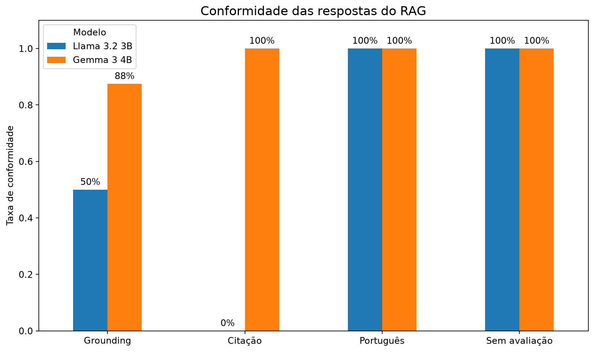

# Eleições 2026 — Data Analysis + GenAI

Neste projeto, analisei dados das candidaturas à Presidência da República nas Eleições 2026 utilizando dados públicos do Tribunal Superior Eleitoral (TSE).

Além dos dados estruturados, explorei os planos de governo utilizando **NLP, embeddings e RAG**, construindo um pipeline capaz de recuperar informações diretamente dos documentos oficiais.

O projeto tem caráter exclusivamente analítico e descritivo. As análises não representam avaliação ou recomendação de candidaturas, partidos ou propostas.

## O que eu quis explorar

Dividi o projeto em duas frentes.

Na primeira, trabalhei com os dados estruturados do TSE para analisar:

- perfil das candidaturas;
- idade e escolaridade;
- bens declarados à Justiça Eleitoral;
- qualidade e consistência dos dados.

Na segunda, trabalhei com os planos de governo para explorar:

- extração de texto de PDFs;
- TF-IDF e similaridade lexical;
- embeddings e busca semântica;
- RAG com modelos locais;
- avaliação de retrieval e grounding.

## Como construí

```text
TSE Open Data
     |
     +--------------------+
     |                    |
     v                    v
Candidaturas       Planos de governo
     |                    |
     v                    v
Processamento          pypdf
     |                    |
     v                    v
    EDA              Corpus textual
                          |
                 +--------+--------+
                 |                 |
                 v                 v
              TF-IDF            Chunking
                 |              500 / 75
                 v                 |
        Similaridade lexical       v
                         qwen3-embedding:0.6b
                                   |
                                   v
                           Busca semântica
                                   |
                                Top-k 3
                                   |
                                   v
                              Gemma 3 4B
                                   |
                                   v
                            Resposta + fontes
```

Considerei no universo principal as candidaturas à Presidência com:

```text
DS_SITUACAO_JULGAMENTO == "DEFERIDO"
```

no snapshot utilizado.

Ao todo, trabalhei com **12 candidaturas deferidas e 12 planos de governo**, totalizando **788 páginas de documentos**.

## O que encontrei nos dados

Na análise dos dados estruturados:

- 12 candidaturas possuíam registro deferido;
- 11 possuíam registros de bens declarados;
- analisei 138 registros individuais de bens;
- a idade média na data da posse era de aproximadamente 59,2 anos;
- 10 das 12 candidaturas possuíam ensino superior completo registrado.

Os valores utilizados representam **bens declarados ao TSE** e não uma estimativa independente de patrimônio líquido ou riqueza.


## Dos PDFs à busca semântica

Comecei extraindo o texto dos planos de governo com `pypdf`.

Para ter um baseline interpretável, utilizei **TF-IDF** para identificar termos relevantes e medir similaridade lexical entre os documentos.

Depois, parti para embeddings e busca semântica.

Minha primeira configuração utilizava:

```text
1000 palavras por chunk
overlap de 150 palavras
```

Nos testes, percebi que chunks grandes podiam misturar assuntos diferentes. Por isso, testei uma segunda configuração:

```text
500 palavras por chunk
overlap de 75 palavras
```

## Como avaliei o retrieval

Em vez de olhar apenas para os scores de similaridade, montei oito consultas sobre temas como educação, saúde, segurança, trabalho, meio ambiente, moradia, infraestrutura e políticas para mulheres.

Avaliei manualmente os cinco primeiros resultados de cada consulta.

| Chunking | Chunks | Resultados relevantes | Precision@5 |
|---|---:|---:|---:|
| 1000 / 150 | 302 | 39/40 | 0.975 |
| **500 / 75** | **598** | **40/40** | **1.000** |

Com base nesse experimento, mantive `500/75` na configuração final.

O `Precision@5 = 1.000` se refere somente às oito consultas e aos 40 resultados avaliados manualmente. Não significa que o retrieval terá desempenho perfeito para qualquer consulta.

## E o RAG?

Com o retrieval funcionando, utilizei os chunks recuperados como contexto para um modelo de linguagem.

Comparei dois modelos locais nas mesmas oito consultas:

- Llama 3.2 3B;
- Gemma 3 4B.

Avaliei quatro critérios separadamente:

| Critério | Llama 3.2 3B | Gemma 3 4B |
|---|---:|---:|
| Grounding | 50.0% | 87.5% |
| Citação das fontes | 0.0% | 100% |
| Português | 100% | 100% |
| Sem avaliação/ranking | 100% | 100% |

Esses números representam **taxas de conformidade nos oito casos avaliados manualmente**, e não acurácia geral dos modelos.



### Um resultado que me chamou atenção

**Ter uma citação não garante grounding.**

Em um dos testes, o Gemma citou a fonte utilizada, mas alterou o sentido de uma informação sobre habitação.

Esse caso mostrou na prática por que avaliei **fidelidade ao documento e presença de citações separadamente**. Uma resposta pode apontar para a fonte correta e, ainda assim, não representar corretamente o que está escrito nela.

Para a configuração final do experimento, mantive:

```text
Chunking: 500 palavras / overlap 75
Embedding: qwen3-embedding:0.6b
Retrieval: cosine similarity
Top-k: 3
LLM: Gemma 3 4B
```

## Estrutura do projeto

```text
eleicoes-2026-data-analysis/
├── data/
├── notebooks/
│   ├── 01_eda_candidatos.ipynb
│   └── 02_nlp_planos_governo.ipynb
├── src/
│   ├── ingestion/
│   ├── processing/
│   ├── analysis/
│   └── visualization/
├── outputs/
│   └── figures/
├── README.md
└── requirements.txt
```

Mantive a implementação em `src/` e utilizei os notebooks principalmente para exploração, análise e apresentação dos resultados.

## Como executar

```bash
git clone https://github.com/Juliocesarbs/applied-ai-projects.git
cd applied-ai-projects/eleicoes-2026-data-analysis

python3 -m venv .venv
source .venv/bin/activate

pip install -r requirements.txt
```

Para embeddings e RAG, utilizei modelos locais com Ollama:

```bash
ollama pull qwen3-embedding:0.6b
ollama pull gemma3:4b
```

Para explorar as análises:

```bash
jupyter notebook
```

Os principais notebooks são:

- `01_eda_candidatos.ipynb` — análise dos dados estruturados;
- `02_nlp_planos_governo.ipynb` — NLP, embeddings, retrieval e RAG.

## Tecnologias

**Python · Pandas · NumPy · Scikit-learn · NLTK · pypdf · Matplotlib · Jupyter · Ollama · Qwen Embeddings · Gemma**

## Limitações

Os dados representam um snapshot da base oficial do TSE e podem sofrer atualizações.

TF-IDF e embeddings representam proximidade textual ou vetorial, não equivalência de propostas ou posicionamentos políticos.

A avaliação de retrieval e RAG também foi realizada sobre um conjunto pequeno de consultas. Os resultados servem para analisar o comportamento deste experimento e não devem ser generalizados para qualquer consulta ou modelo.